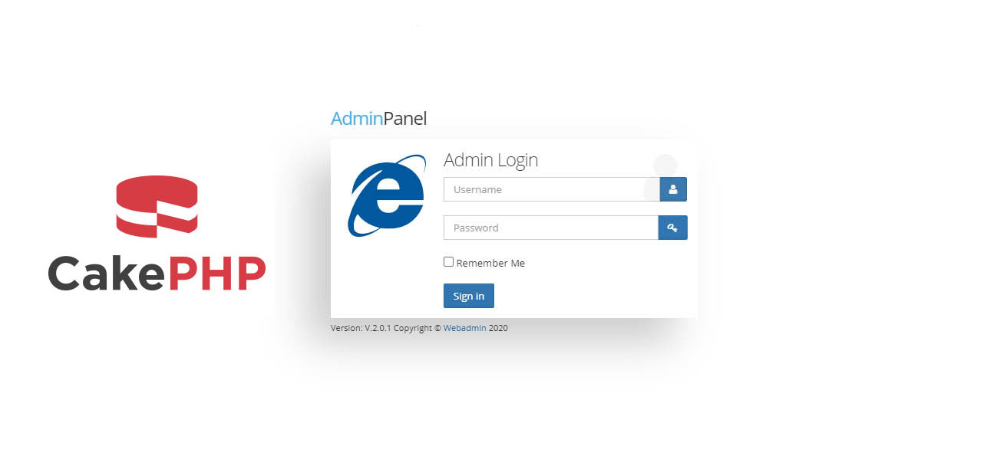

# CakePHP 4 Strawberry - Admin Panel with Article management

Features Included

Admin Panel with Responsive Theme Linked

Admin Authentication

Theme Building with layouts, blocks and rendering

Article Creation, Updation, Deletion

File Uploading Option and Management

This is a sample project for helping beginners, which you can use as  a skelton for developing your project

